# CloudGuard

Java/Spring 기반 클라우드 비용 관리 백엔드 프로젝트입니다.

현재는 EC2, RDS, S3 비용 데이터를 직접 등록하고 월별·서비스별로 집계하며,
월 예산 대비 사용률과 상태를 조회하는 기능까지 구현했습니다.
AWS Cost Explorer와 CloudWatch 연동, 장애 관리는 다음 단계로 개발할 예정입니다.

## 개발 목적

클라우드 운영에서는 비용 데이터와 예산 기준을 함께 확인해야 합니다.
CloudGuard는 비용 기록, 월별 집계, 예산 정책을 하나의 서비스에서 관리하고
향후 AWS 비용·장애 정보까지 통합하는 것을 목표로 합니다.

## 현재 구현 범위

### 비용 관리

- EC2, RDS, S3 비용 기록 등록
- 특정 월의 전체 누적 비용 조회
- 특정 월·서비스의 누적 비용 조회
- 특정 월의 서비스별 비용과 전체 비용 상세 조회
- 비용 기록이 없는 서비스도 0으로 반환

### 예산 관리

- 월 예산 등록 및 변경
- 동일 연월 예산 중복 등록 시 409 Conflict 반환
- 등록되지 않은 연월 조회·변경 시 404 Not Found 반환
- 0 이하의 예산 등록·변경 시 400 Bad Request 반환
- 월 누적 비용과 예산을 이용한 사용률 계산
- 사용률에 따른 SAFE, CAUTION, WARNING, EXCEEDED 상태 판정
- 연월, 월 예산, 누적 비용, 사용률, 상태를 포함한 상세 응답 제공

### 예산 상태 기준

| 사용률 | 상태 |
| --- | --- |
| 70% 미만 | SAFE |
| 70% 이상 85% 미만 | CAUTION |
| 85% 이상 100% 미만 | WARNING |
| 100% 이상 | EXCEEDED |

## API

| Method | Endpoint | 설명 |
| --- | --- | --- |
| POST | `/api/costs/add-cost` | 비용 기록 등록 |
| GET | `/api/costs/monthly?yearMonth=yyyy-MM` | 월 누적 비용 조회 |
| GET | `/api/costs/monthly/by-service?yearMonth=yyyy-MM&service=EC2` | 월·서비스별 비용 조회 |
| GET | `/api/costs/monthly/breakdown?yearMonth=yyyy-MM` | 서비스별 비용과 전체 비용 상세 조회 |
| POST | `/api/budgets/add` | 월 예산 등록 |
| PUT | `/api/budgets/{yearMonth}` | 월 예산 변경 |
| GET | `/api/budgets/status?yearMonth=yyyy-MM` | 예산 사용률과 상태 상세 조회 |

## 설계 기준

- **Controller**: HTTP 요청과 응답 처리
- **Service**: 비용·예산 조회와 전체 흐름 조정
- **Domain**: 비용 합산, 사용률 계산, 상태 판정 등 비즈니스 규칙 수행
- **Repository**: JPA를 이용한 비용·예산 데이터 저장 및 조회

사용률 계산과 상태 판정은 `BudgetPolicy`가 담당합니다.
월별 비용 합산과 서비스별 집계는 `MonthlyCost`가 담당하도록 책임을 분리했습니다.

## 테스트

- **도메인 테스트**: 비용·예산 값 검증, 월별 합산, 상태 경계값 검증
- **Repository 테스트**: 연월과 서비스 조건에 따른 데이터 조회 검증
- **Service 통합 테스트**: 실제 Repository와 테스트 DB를 이용한 비용 집계·예산 상태 검증
- **Controller 테스트**: MockMvc를 이용한 요청, 응답 JSON, HTTP 상태 코드 검증
- **수동 검증**: Postman으로 예산 등록·변경 후 상태 재계산 흐름 확인

검증 시 월 예산 10,000, 누적 비용 8,000에서 사용률 80%와 CAUTION을 확인했습니다.
이후 예산을 20,000으로 변경했을 때 동일한 비용에서 사용률 40%와 SAFE로
재계산되는 전체 흐름을 확인했습니다.

## 기술 스택

- Java 17
- Spring Boot
- Spring MVC
- Spring Data JPA
- MySQL
- H2
- JUnit 5
- AssertJ
- MockMvc
- Gradle
- Postman

## 개발 현황

- [x] 프로젝트 초기 설정
- [x] 비용 도메인 설계
- [x] 예산 정책과 상태 경계값 구현
- [x] 비용 기록 등록
- [x] 월 누적 비용 조회
- [x] 서비스별 비용 조회
- [x] 월별 비용 상세 조회
- [x] 월 예산 등록·변경
- [x] 예산 사용률과 상태 상세 조회
- [x] 도메인·Repository·Service·Controller 테스트
- [ ] AWS 계정 등록
- [ ] AWS Cost Explorer 자동 수집
- [ ] CloudWatch 경보 연동
- [ ] 비용 경고 생성 및 중복 방지
- [ ] 장애 생성·담당자·처리 상태 관리
- [ ] AWS 배포

## 개발 기록

### 2026-08-05

- 프로젝트 초기 설정
- 비용·예산 도메인 설계
- `BudgetPolicy` 상태 경계값 테스트 작성

### 2026-08-08

- `CostRecord`를 JPA Entity로 전환
- 비용 값, 서비스, 발생일 검증 추가

### 2026-08-10

- `CostRecordRepository`와 `CostService` 구현
- 특정 월의 비용을 DB에서 조회해 합산하는 흐름 구현
- Spring Boot와 DB 자동 구성 문제를 분석하고 테스트 환경 수정

### 2026-08-11

- 비용 등록 API 구현
- MockMvc와 Postman으로 비용 등록·예산 상태 조회 검증
- 통합 테스트 데이터 롤백 적용

### 2026-08-13 ~ 2026-08-14

- 월 예산 등록·변경 구현
- 중복 등록 409, 미등록 연월 404, 잘못된 예산 400 응답 구현
- JPA 변경 감지 후 DB 반영 흐름 검증

### 2026-08-22 ~ 2026-08-23

- 월·서비스별 비용 조회 구현
- EC2, RDS, S3 비용 상세 집계 구현
- 예산 상태 API를 연월, 예산, 누적 비용, 사용률, 상태를 포함한 응답으로 확장
- 실제 DB, MockMvc, Postman을 이용한 전체 흐름 검증

## 검증 화면

### 월별 비용 상세 조회

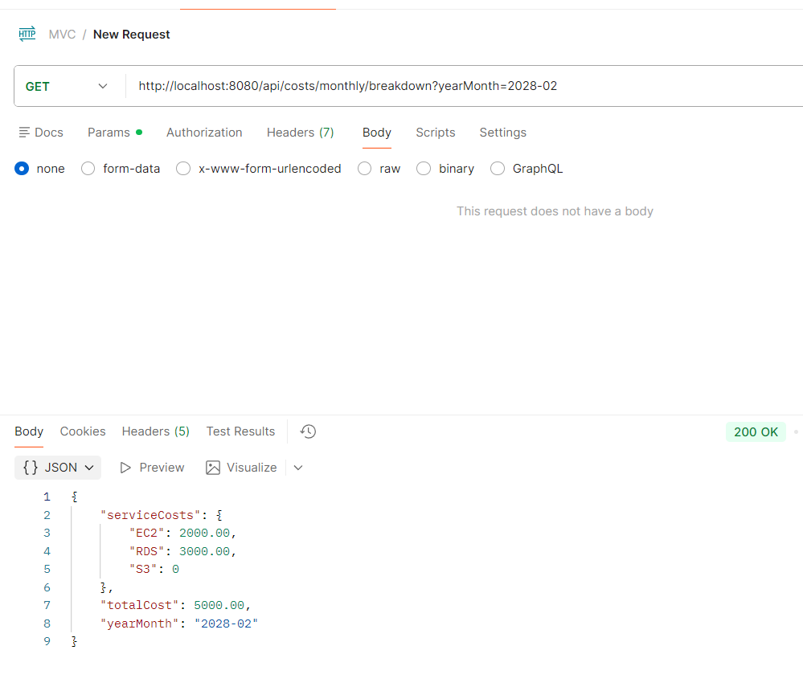

### 예산 상태 상세 조회

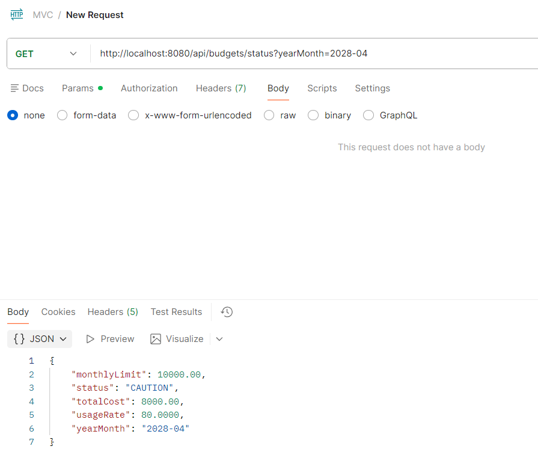

### CostService Test 진행 중 에러

초기에
@SpringBootApplication(exclude = DataSourceAutoConfiguration.class)
를 켜서 DB없어도 Test를 진행하기위해 설정해놓을걸 까먹고 안지웠다가
Test진행중 Spring Boot와 DB 연결을 자동으로 구성하는걸 막아
CostRecordRepository Bean을 만들수 없는 에러 발생

지우고 다시 실행 -> 성공

## 2026-08-11

* `CostController`와 `CostCreateRequest` DTO 구현
* `POST /api/costs/add-cost` 비용 등록 API 구현
*  Postman으로 비용 저장 및 예산 상태 조회 흐름 검증

    * 비용 `800`, 월 예산 `1000` → `CAUTION` 반환 확인
* `CostControllerTest` 작성 및 통과

    * `MockMvc`로 POST 요청 검증
    * `@MockitoBean`으로 `CostService` 모킹
    * `given().willReturn()`으로 가짜 반환값 설정
    * HTTP 상태 코드와 응답 JSON 검증
* `CostServiceTest`에 `@Transactional`을 적용해 테스트 데이터 롤백 처리

## 2026-08-13

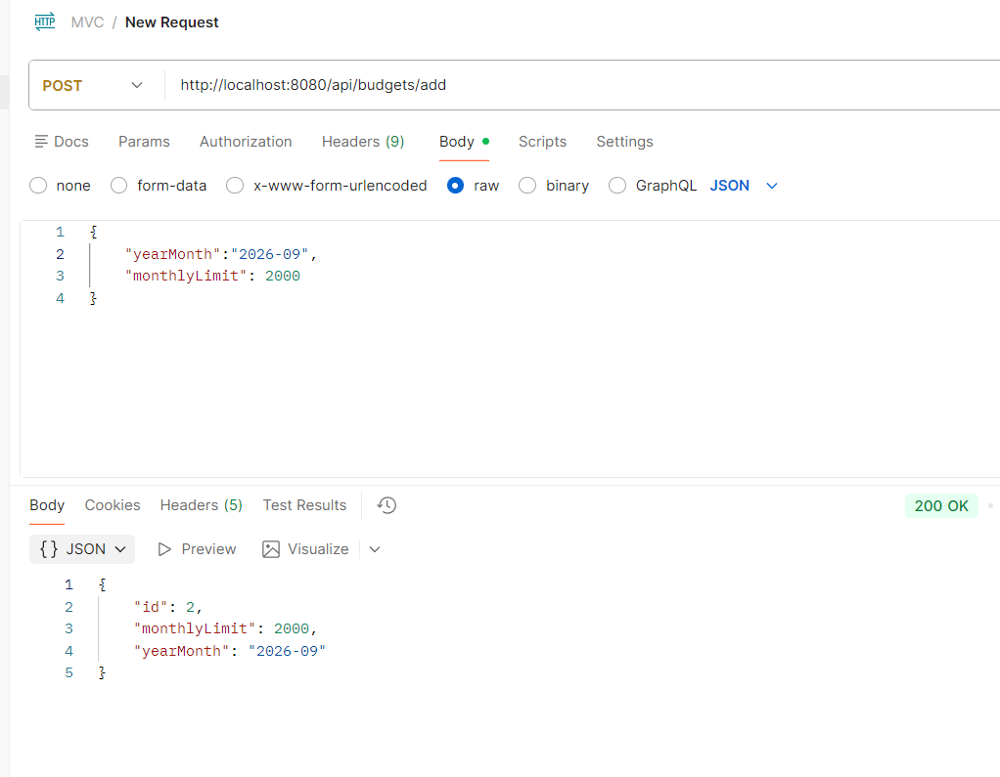

POSTMAN 활용해서 request보내고 잘 보내졌는지 확인

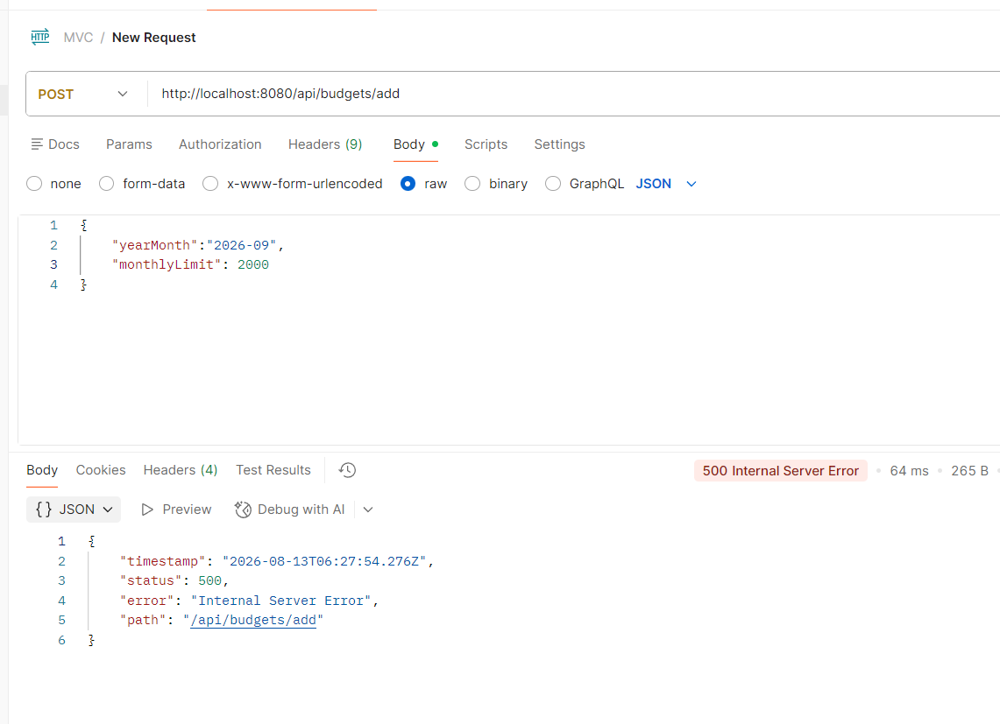

POSTMAN 활용해서 DB 중복 데이터에 대해 에러발생하는지 확인

## 2026-08-14

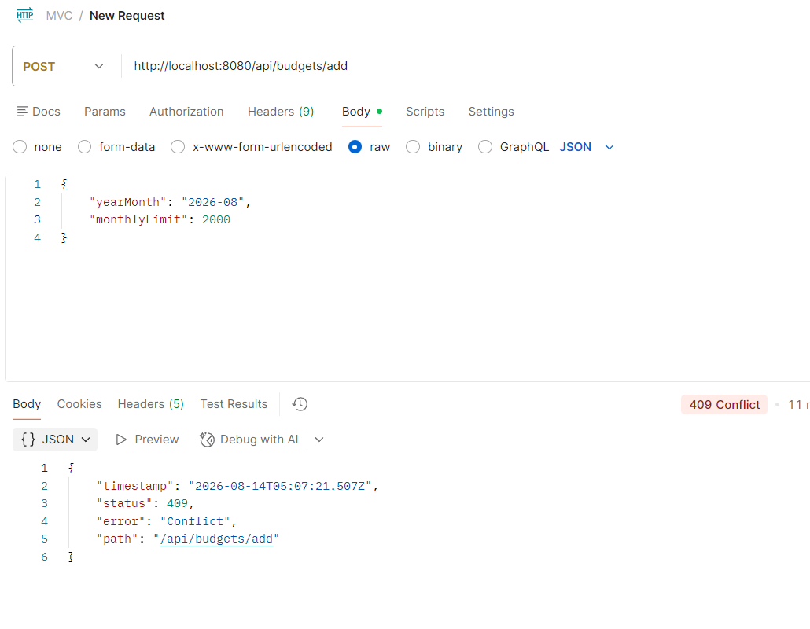

반환 에러메시지 500 -> 409 conflict로 변경

## 2026-08-22

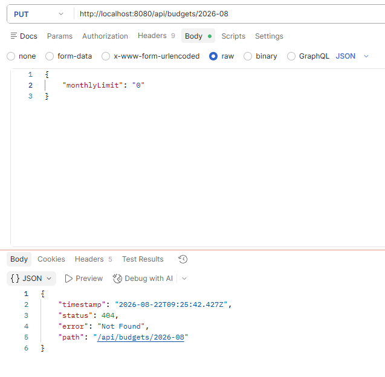

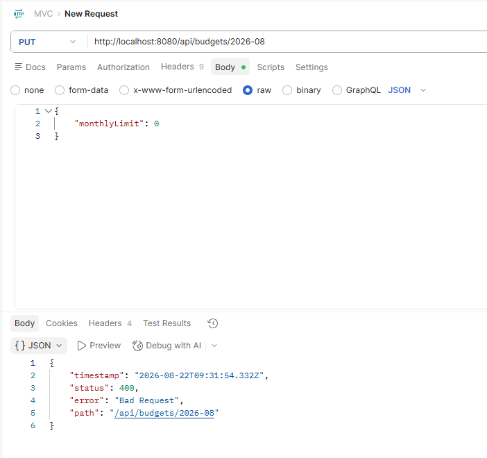

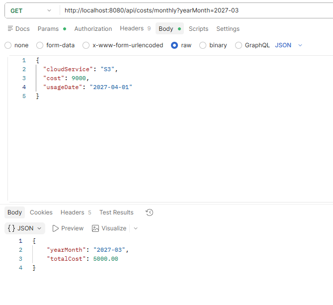


## 2026-08-23

### EnumMap과 merge를 이용한 서비스별 비용 합산 <개념숙지체크>

`EnumMap`은 enum 타입을 키로 사용할 때 특화된 `Map` 구현체다.

Map<CloudService, BigDecimal> totals =
        new EnumMap<>(CloudService.class);

여기서 각 타입의 의미는 다음과 같다.

* `CloudService`: Map의 키 타입
* `BigDecimal`: Map에 저장되는 비용의 타입
* `CloudService.class`: EnumMap이 어떤 enum을 키로 사용하는지 알려주는 정보

`CloudService.values()`는 `EnumMap`의 메서드가 아니라 모든 enum에 자동으로 제공되는 정적 메서드다. 선언된 모든 enum 상수를 순서대로 배열로 반환한다.

for (CloudService service : CloudService.values()) {
    totals.put(service, BigDecimal.valueOf(0));
}

현재 `CloudService`에는 `EC2`, `RDS`, `S3`가 있으므로 처음 Map은 다음 상태가 된다.

EC2 = 0
RDS = 0
S3 = 0

이렇게 모든 서비스를 0으로 초기화하면 해당 월에 비용 기록이 없는 서비스도 결과에서 누락되지 않고 0으로 반환할 수 있다.

`Map.merge()`는 기존 값의 존재 여부에 따라 값을 저장하거나 합산한다.

totals.merge(
        costRecord.getService(),
        costRecord.getCost(),
        BigDecimal::add
);

`merge()`의 동작은 다음과 같다.

* 키가 없으면 전달받은 값을 새로 저장한다.
* 키가 있으면 기존 값과 새로운 값에 지정한 함수를 적용한다.

`BigDecimal::add`는 다음 람다식과 같은 의미의 메서드 참조다.

existingCost = 이미 존재하고있는 비용 (기존비용)
newCost = 새로운 비용 (추가한 비용)

(existingCost, newCost) -> existingCost.add(newCost)

예를 들어 EC2의 초기값이 0이고 비용 기록이 3000, 1000 순서로 들어오면 다음처럼 계산된다.

0 + 3000 = 3000
3000 + 1000 = 4000

`BigDecimal`은 값을 직접 변경하지 않는 불변 객체이므로 `add()`가 새로운 합계 객체를 반환하고, 
`merge()`가 그 결과를 다시 Map에 저장함

--------------------------------

### Stream과 reduce를 이용한 비용 합산

다음 코드는 서비스별 비용이 들어 있는 Map에서 모든 비용을 더해 총비용을 계산한다.

BigDecimal totalCost = serviceCosts.values()
        .stream()
        .reduce(BigDecimal.ZERO, BigDecimal::add);
#### `values()`의 역할

`serviceCosts`의 타입은 다음과 같다.

Map<CloudService, BigDecimal>

예를 들어 Map에 다음 값이 저장돼 있다고 가정한다.

EC2 = 4000
RDS = 2000
S3 = 0

`values()`를 호출하면 키를 제외하고 비용 값들만 가져온다.

serviceCosts.values()

결과는 다음과 같은 값의 모음이다.
[4000, 2000, 0]

#### `stream()`의 역할

`stream()`은 컬렉션의 값을 하나씩 순서대로 처리할 수 있는 Stream 흐름으로 변환한다.

serviceCosts.values().stream()

Stream은 데이터를 직접 저장하는 자료구조가 아니다. 
기존 컬렉션의 데이터를 대상으로 필터링, 변환, 합산 등의 연산을 연결해서 실행할 수 있도록 만든 처리 흐름이다.

`stream()`을 호출하는 것만으로는 값이 변경되거나 합산되지 않는다. 실제 처리는 `reduce()`와 같은 최종 연산이 호출될 때 실행된다.

#### `reduce()`의 역할

`reduce()`는 여러 값을 하나의 결과로 줄이는 최종 연산이다.

.reduce(BigDecimal.ZERO, BigDecimal::add)

첫 번째 인자인 `BigDecimal.ZERO`는 합산을 시작할 초기값이다.

두 번째 인자인 `BigDecimal::add`는 기존 합계와 다음 비용을 더하는 방법이다.

(currentTotal, nextCost) -> currentTotal.add(nextCost)

실제 계산 흐름은 다음과 같다.

초기값: 0

0 + 4000 = 4000
4000 + 2000 = 6000
6000 + 0 = 6000

최종 결과: 6000

초기값으로 0을 사용하는 이유는 어떤 값에 0을 더해도 원래 값이 유지되기 때문이다. 비용 데이터가 하나도 없는 빈 Stream이어도 결과로 0을 반환할 수 있다.

#### 반복문과 비교

Stream을 사용하지 않으면 다음 반복문과 같은 의미다.

BigDecimal totalCost = BigDecimal.ZERO;

for (BigDecimal cost : serviceCosts.values()) {
    totalCost = totalCost.add(cost);
}

두 코드는 같은 결과를 만든다.

Stream 방식은 “값들을 순서대로 반복한다”는 과정 대신 “여러 비용을 하나의 합계로 줄인다”는 목적을 표현할 수 있다는 장점이 있다.

또한 Stream으로 합산해도 기존 `serviceCosts` Map의 값은 변경되지 않는다.

-------------------------------------------


월별 비용 상세 기능 도메인,Repository,Service,Controller,실제 DB 까지 완료

--------------------------------------------

다음단계로 현재 예산 상태 API를 상세 응답으로 업데이트 진행

현재는 `SAFE` 라는 STATUS만 나옴

목표는

`{
    "yearMonth" : "2028-02",
    "monthlyLimit": 10000,
    "totalCost": 5000,
    "usageRate": 50.0000,
    "status": "SAFE"
}
`

이제 사용률을 외부에서도 가져올수 있도록 BudgetPolicy의 기존 private을 public으로 교체
- 왜? 사용률 계산 규칙의 책임은 BudgetPolicy에 있기 떄문
- Controller : HTTP 요청 & 응답
- Service : 예산과 비용 조회 및 흐름 조정
- BudgetPolicy : 사용률 계산과 상태 판정

------------------------------------------

### 예산 상태 상세 조회 검증

- 월 예산: 10,000
- 월 누적 비용: 8,000
- 사용률: 80%
- 예산 상태: `CAUTION`

월 예산을 20,000으로 변경한 후:

- 월 누적 비용: 8,000
- 사용률: 40%
- 예산 상태: `SAFE`

예산 변경값이 DB에 반영되고, 
상세 상태 조회 시 예산,비용,사용률,상태가 함께 재계산되는 전체 흐름을 Postman으로 검증.


상세 예산 설정 성공

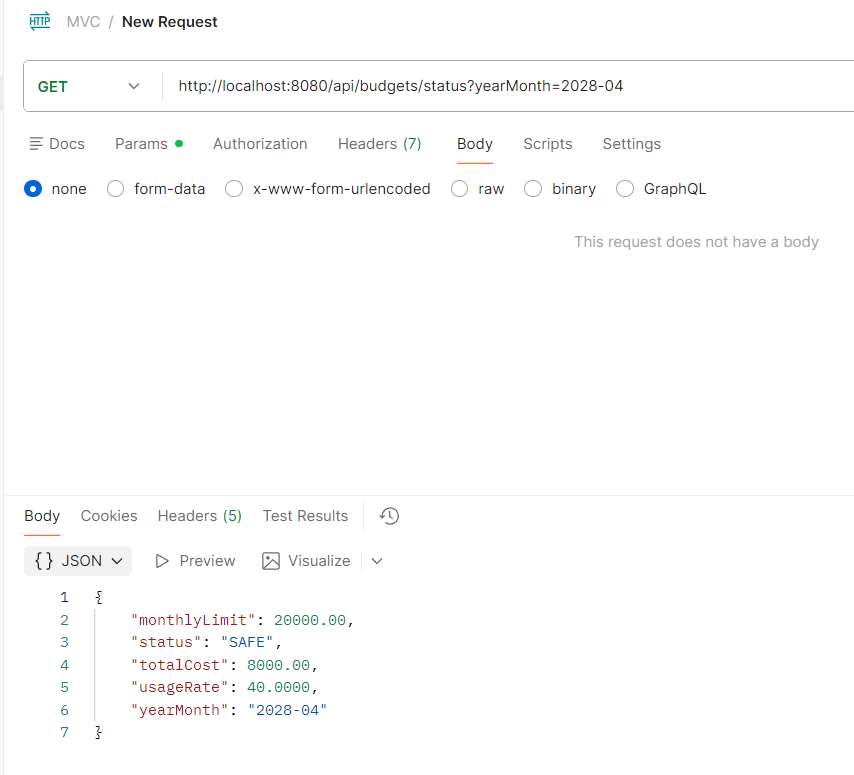
상세 예산 업데이트 설정 성공

# 2026-08-24

현재 예외마다 @ResponseStatus가 있어서 HTTP 상태 코드는 맞지만, 응답 본문은 Spring 기본 형식
이에 따라 다음처럼 일관된 응답으로 업데이트
```json
{
"timestamp": "2026-08-24T14:00:00",
"status": 404,
"code": "MONTHLY_BUDGET_NOT_FOUND",
"message": "해당 연월의 예산이 등록되어 있지 않습니다.",
"path": "/api/budgets/status"
}
```

common << 공통 모듈을 모아놓는 패키지로 설정
common.exception 으로 공통예외를 모아놓을 예정

- 예산 예외
- 비용 예외
- 잘못된 요청 파라미터
- AWS 연동 예외
- CloudWatch 연동 예외

----각 변수 설명----

- timestamp : 예외가 응답된 시각
- status : HTTP 상태 코드
- code : 클라이언트가 구분할 애플리케이션 오류 코드
- message : 사람이 확인할 오류 설명
- path : 예외가 발생한 요청 경로

### @RestControllerAdvice는 무엇인가?

- 여러 Controller에서 발생하는 예외를 한곳에서 공통 처리하도록 등록하는 어노테이션
- @ControllerAdvice + @ResponseBody 와 같음
- @ControllerAdvice : 모든 Controller에서 발생한 예외 감시
- @ResponseBody : 반환한 ErrorResponse를 JSON으로 변환

- BudgetController 실행
  → BudgetService에서 MonthlyBudgetNotFoundException 발생
  → Controller 밖으로 예외 전달
  → @RestControllerAdvice가 예외 감지
  → 해당 @ExceptionHandler 메서드 실행
  → ErrorResponse를 JSON으로 반환

- @ExceptionHandler는 어떤 예외를 처리할지 지정

```java
@ExceptionHandler(MonthlyBudgetNotFoundException.class)
```
`MonthlyBudgetNotFoundException`이 발생하면 바로 Handler밑의 메소드가 처리

클래스에 `Global`를 붙인 이유는?
- 특정 Controller 전용이 아닌 애플리케이션 전체 Controller에 적용할 예외 처리 클래스란 뜻
전역 동작을 만드는건 `@RestControllerAdvice` 덕분

----------------------------------

### POSTMAN 테스트 진행
1. 미등록 예산 조회 - 404
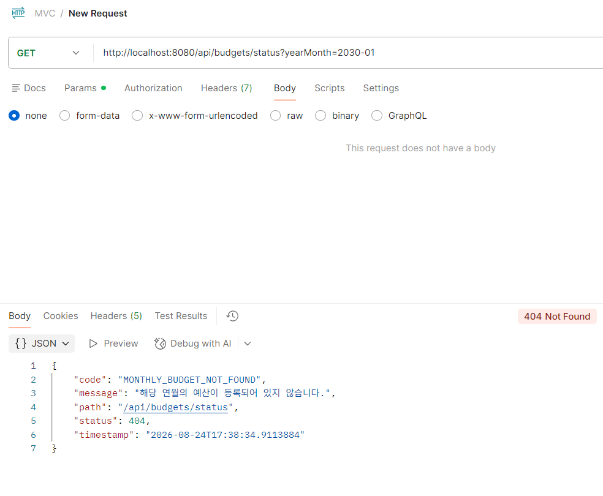
2. 중복 예산 등록 -409
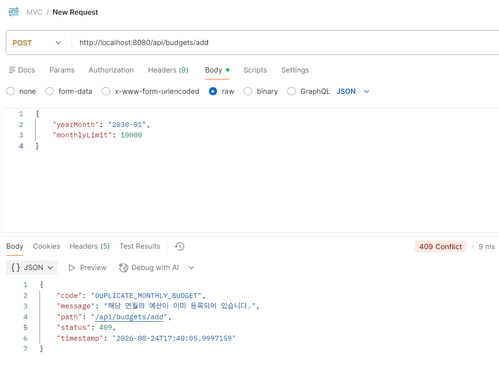
3. 잘못된 예산 변경 - 400
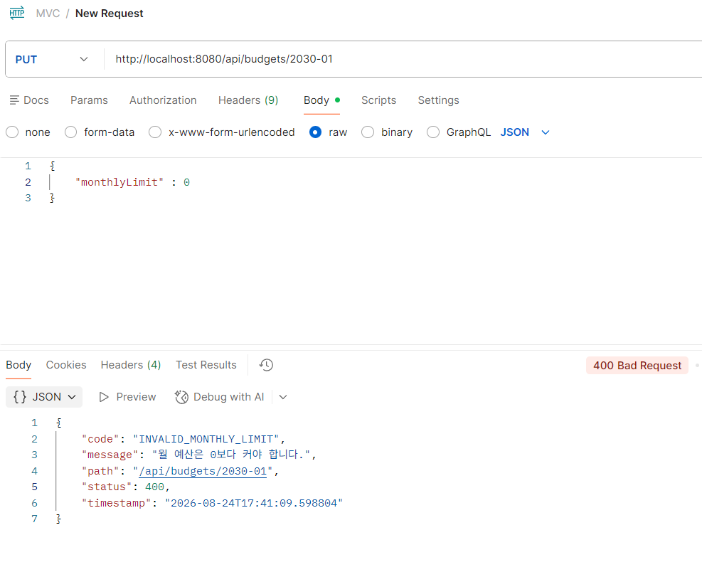


### `@Valid` 검증 오류 메시지 추출 과정 <새로알게된 개념>

요청 DTO에 `@NotNull`, `@Positive` 등의 검증 규칙을 선언하고 Controller의 `@RequestBody` 앞에 `@Valid`를 적용했다.

잘못된 요청이 들어오면 Controller와 Service를 실행하기 전에 DTO 검증이 수행되고, 검증 실패 시 `MethodArgumentNotValidException`이 발생한다.

```text
JSON 요청
→ Jackson이 요청 DTO 생성
→ @Valid가 DTO 검증
→ 검증 실패
→ MethodArgumentNotValidException 발생
→ GlobalExceptionHandler가 공통 오류 응답 생성
```

검증 오류 메시지는 다음 코드로 추출한다.

```java
String message = exception.getBindingResult()
        .getFieldErrors()
        .stream()
        .findFirst()
        .map(DefaultMessageSourceResolvable::getDefaultMessage)
        .orElse("잘못된 요청입니다.");
```

각 메서드의 역할은 다음과 같다.

* `getBindingResult()`: `@Valid`가 수행한 전체 검증 결과를 가져온다.
* `getFieldErrors()`: 전체 검증 결과 중 DTO 필드에서 발생한 오류들을 `List<FieldError>`로 가져온다.
* `stream()`: 필드 오류 목록을 순서대로 처리할 수 있는 Stream으로 변환한다.
* `findFirst()`: 오류 목록 중 첫 번째 오류를 `Optional<FieldError>`로 가져온다.
* `map()`: `FieldError`에서 어노테이션에 작성한 검증 메시지만 추출한다.
* `orElse()`: 검증 메시지를 가져오지 못한 경우 기본 메시지를 반환한다.

다음 메서드 참조는:

```java
DefaultMessageSourceResolvable::getDefaultMessage
```

아래 람다식과 같은 의미다.

```java
fieldError -> fieldError.getDefaultMessage()
```

예를 들어 다음 요청이 들어오면:

```json
{
  "monthlyLimit": 0
}
```

`@Positive` 검증이 실패하고 다음 메시지가 추출된다.

```text
월 예산은 0보다 커야 합니다.
```

최종 처리 흐름은 다음과 같다.

```text
monthlyLimit = 0
→ @Positive 검증 실패
→ FieldError 생성
→ 첫 번째 FieldError 선택
→ 검증 메시지 추출
→ ErrorResponse의 message에 저장
→ 400 Bad Request 반환
```

현재 `ErrorResponse`는 메시지를 하나만 가지므로 여러 필드가 동시에 실패하더라도 첫 번째 오류 메시지만 반환한다. 추후 필요하면 모든 필드 오류를 목록으로 반환하는 구조로 확장할 수 있다.


## POSTMAN에서 테스트 진행

1. 등록 요청에서 연월 누락 케이스

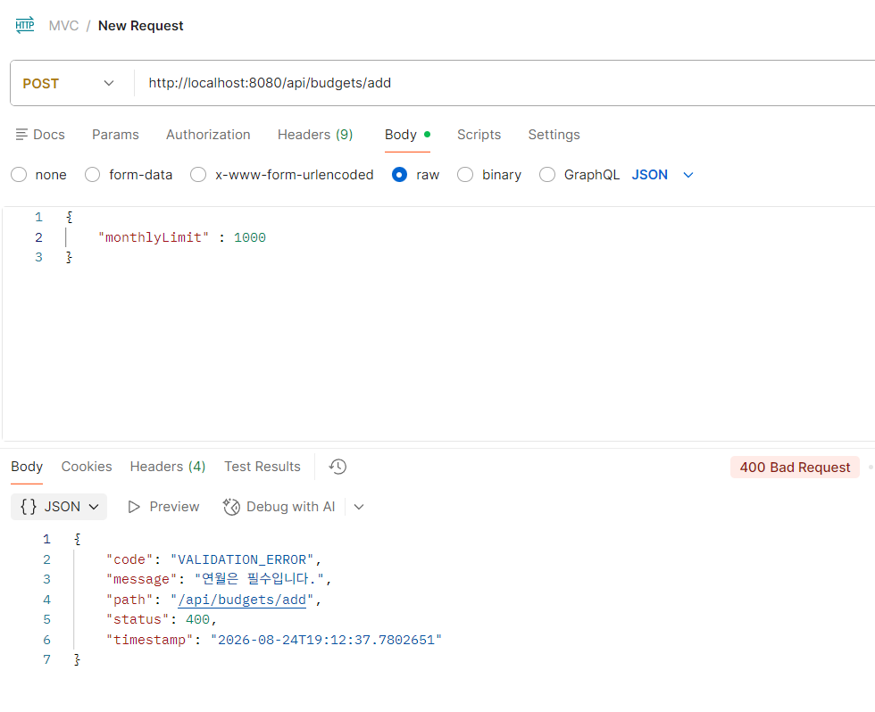

2. 변경 요청에서 월 예산 누락 케이스

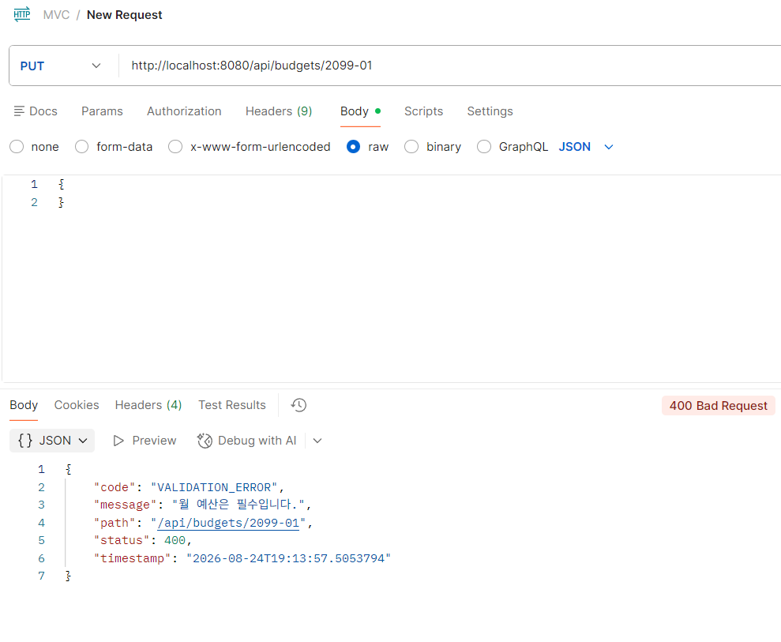

# 2026-08-26

- handleHttpMessageNotReadable 메소드에 return값으로
- exception.getMessage()를 그대로 반환하지 않는 이유는 Jackson 내부 클래스와 변환 오류 같은 
- 엄청 긴 기술 정보가 포함될수도 있음. -> 굳이 클라이언트에게 보낼필요없는 메세지까지 보낸다는 뜻

### Json변환 실패와 파라미터 변환 실패때 실행되는 예외메소드

@RequestBody JSON 변환 실패
→ HttpMessageNotReadableException

@RequestParam 또는 @PathVariable 변환 실패
→ MethodArgumentTypeMismatchException


### `@ParameterizedTest`로 중복 테스트 제거 <- @Test로 3번할거 한번만에 가능

비용 등록 요청에서 `cloudService`, `cost`, `usageDate`가 누락되는 세 가지 경우를 검증해야 했다.

각 경우마다 별도의 `@Test`를 작성하면 요청수행과 응답 검증코드가 반복된다. 
입력 JSON과 예상 메시지만 다르므로 `@ParameterizedTest`와 `@MethodSource`를 사용해 하나의 테스트를 여러 데이터로 실행했다.

```java
@ParameterizedTest
@MethodSource("invalidCostCreateRequests")
void 비용등록시_필수값이_누락되면_400(
        String requestBody,
        String expectedMessage
) throws Exception {
    mockMvc.perform(post("/api/costs/add-cost")
                    .contentType(MediaType.APPLICATION_JSON)
                    .content(requestBody))
            .andExpect(status().isBadRequest())
            .andExpect(jsonPath("$.timestamp").exists())
            .andExpect(jsonPath("$.status").value(400))
            .andExpect(jsonPath("$.code")
                    .value("VALIDATION_ERROR"))
            .andExpect(jsonPath("$.message")
                    .value(expectedMessage))
            .andExpect(jsonPath("$.path")
                    .value("/api/costs/add-cost"));

    verifyNoInteractions(costService);
}
```

일반적인 `@Test`는 테스트 메서드를 한 번 실행하지만, 
`@ParameterizedTest`는 전달된 데이터의 개수만큼 같은 테스트 메서드를 반복 실행한다.
이는 이번 테스트를 구현해보면서 새롭게 알게되었다.

```java
@MethodSource("invalidCostCreateRequests")
```

`@MethodSource`는 테스트에 전달할 데이터를 제공하는 메서드 이름을 지정한다. 여기서는 `invalidCostCreateRequests()`가 반환하는 데이터를 사용한다.

```java
static Stream<Arguments> invalidCostCreateRequests() {
    return Stream.of(
            Arguments.of(
                    """
                    {
                        "cost": 1000,
                        "usageDate": "2026-08-26"
                    }
                    """,
                    "클라우드 서비스는 필수입니다."
            ),
            Arguments.of(
                    """
                    {
                        "cloudService": "EC2",
                        "usageDate": "2026-08-26"
                    }
                    """,
                    "비용은 필수입니다."
            ),
            Arguments.of(
                    """
                    {
                        "cloudService": "EC2",
                        "cost": 1000
                    }
                    """,
                    "비용 발생일은 필수입니다."
            )
    );
}
```

`Stream<Arguments>`는 테스트에 전달할 여러 매개변수 묶음을 제공한다.

각 `Arguments.of()`의 첫 번째 값은 `requestBody`에, 두 번째 값은 `expectedMessage`에 전달된다.

```text
Arguments.of(요청 JSON, 예상 메시지)
                 ↓           ↓
          requestBody  expectedMessage
```

따라서 테스트는 총 세 번 실행된다.

```text
첫 번째 실행
→ cloudService 누락
→ "클라우드 서비스는 필수입니다."

두 번째 실행
→ cost 누락
→ "비용은 필수입니다."

세 번째 실행
→ usageDate 누락
→ "비용 발생일은 필수입니다."
```

각 실행에서 `@Valid`가 누락 필드를 발견하면 Controller 메서드와 `CostService`는 실행되지 않는다.

```java
verifyNoInteractions(costService);
```

이 검증을 통해 잘못된 요청이 서비스 계층에 전달되기 전에 차단되는 것도 확인한다.

매개변수화 테스트를 사용할 때는 각 테스트 데이터가 의도한 규칙 하나만 실패하도록 구성해야 한다. 
여러 필드가 동시에 잘못되면 `findFirst()`가 어떤 필드 오류를 선택하는지에 따라 테스트 결과가 달라질 수 있다.

`@ParameterizedTest`를 사용하면서 반복되는 MockMvc 검증 코드를 제거하고, 검증 사례를 추가할 때 `Arguments.of()`만 추가할 수 있게 됐다.

추가로 `costs` 라고 오타가난걸 `cost`로 다시 수정했다.

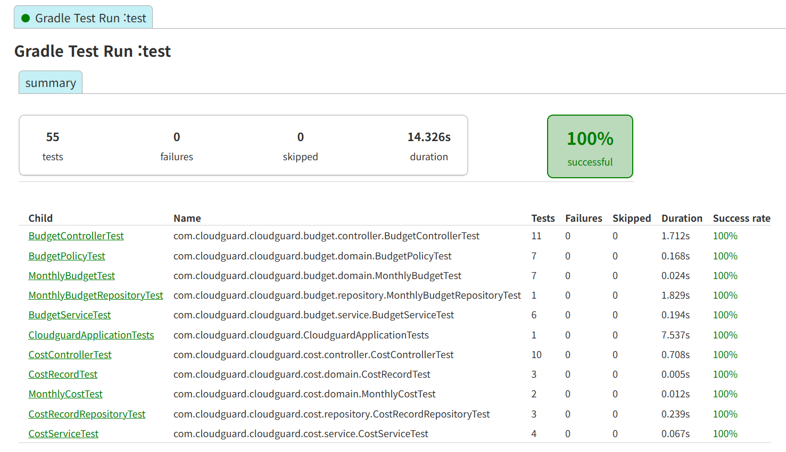

자동 수집 구조 설계 전 ./gradlew test 진행

## AWS Cost Explorer 연동 시작

기존 CloudGuard에서는 비용 데이터를 다음 API를 통해 직접 등록했다.

```http
POST /api/costs/add-cost
```

이 API는 비용 도메인과 예산 상태 계산을 구현하고 테스트하기 위한 입력 수단이었다. 실제 서비스에서는 사용자가 비용을 일일이 입력하는 것이 아니라, AWS Cost Explorer에서 계정의 비용 데이터를 자동으로 가져오는 구조가 필요하다.

목표 흐름은 다음과 같다.

```text
AWS Cost Explorer
→ 서비스별 비용 조회
→ AWS 응답을 내부 DTO로 변환
→ CloudGuard DB 저장
→ 월 누적 비용 계산
→ 예산 사용률 및 상태 판단
```

### AWS CLI 인증 확인

로컬 개발 환경이 AWS 계정에 연결됐는지 확인했다.
(본인의 AWS 계정을 활용했음)

```bash
aws --version
aws sts get-caller-identity
```

`aws sts get-caller-identity`가 IAM 사용자 정보를 반환하면서 AWS CLI 자격 증명이 정상적으로 설정됐음을 확인했다.

AWS Access Key와 Secret Key는 애플리케이션 코드나 `application.yml`, GitHub 저장소에 작성하지 않는다. << 중요하다 잊지마라

로컬 환경에서는 AWS CLI에 설정된 자격 증명을 사용하고, 추후 EC2나 ECS에 배포할 때는 서버에 IAM Role을 부여한다. AWS SDK의 기본 자격 증명 체인을 사용하면 실행 환경에 따라 적절한 자격 증명을 자동으로 찾을 수 있다.

```text
로컬 실행
→ AWS CLI 프로필의 자격 증명 사용

배포 환경
→ EC2 또는 ECS에 연결된 IAM Role 사용

GitHub
→ Access Key와 Secret Key를 저장하지 않음
```

### Cost Explorer 실제 비용 조회

다음 명령으로 2026년 8월의 서비스별 비용을 조회했다.

```bash
aws ce get-cost-and-usage \
  --time-period Start=2026-08-01,End=2026-08-27 \
  --granularity MONTHLY \
  --metrics UnblendedCost \
  --group-by Type=DIMENSION,Key=SERVICE \
  --region us-east-1
```

`End` 날짜는 조회 범위에 포함되지 않는다. 따라서 `2026-08-27`을 지정하면 `2026-08-26`까지의 비용이 조회된다.

주요 옵션의 의미는 다음과 같다.

| 옵션                        | 의미                  |
|---------------------------| ------------------- |
| `--time-period`           | 비용을 조회할 기간          |
| `--granularity MONTHLY`   | 월 단위 비용 조회          |
| `--metrics UnblendedCost` | 할인 분배 전 실제 사용 비용 조회 |
| `--group-by ... SERVICE`  | AWS 서비스별로 비용 분류     |
| `--region us-east-1`      | API 요청에 사용할 리전      |

실제 응답을 통해 다음 서비스들이 조회됐다.

```text
AWS Glue
AWS Key Management Service
EC2 - Other
Amazon Simple Storage Service
Tax
```

서비스별 비용은 다음 구조로 반환된다.

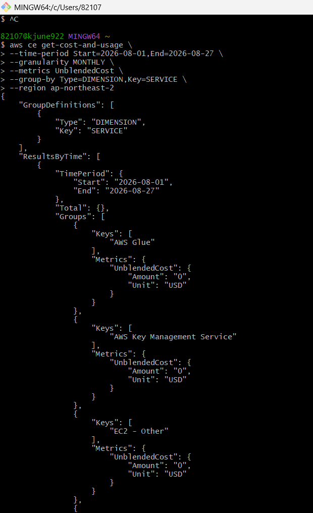

```json
{
  "Keys": [
    "Amazon Simple Storage Service"
  ],
  "Metrics": {
    "UnblendedCost": {
      "Amount": "0.0000000488",
      "Unit": "USD"
    }
  }
}
```

각 값의 의미는 다음과 같다.

```text
Keys[0]
→ AWS가 사용하는 원본 서비스 이름

Amount
→ 해당 서비스에서 발생한 비용

Unit
→ 비용의 통화 단위
```

AWS는 비용을 문자열로 반환하므로 Java에서는 정확한 소수 계산을 위해 `double`이 아니라 `BigDecimal`로 변환한다.

```java
BigDecimal amount = new BigDecimal(amountValue);
```

응답의 다음 값도 확인했다.

```json
"Estimated": true
```

현재 청구 기간이 끝나지 않았기 때문에 아직 확정되지 않은 예상 비용이라는 의미다. 추후 CloudGuard에서도 비용의 상태를 알 수 있도록 `estimated`와 `lastSyncedAt` 같은 정보를 제공할 필요가 있다.

`Total`이 빈 객체로 반환된 것도 오류가 아니다.

```json
"Total": {}
```

이번 요청은 `SERVICE`를 기준으로 그룹화했기 때문에 전체 합계 하나가 아니라 `Groups` 내부에 서비스별 비용이 들어간다.

Cost Explorer 데이터는 완전한 실시간 데이터가 아니며 최소 하루 한 번 갱신된다. 일부 비용은 24시간보다 늦게 반영될 수도 있다. 또한 Cost Explorer API는 페이지 요청 단위로 비용이 발생하므로 지나치게 짧은 간격으로 호출하지 않고, 이후 스케줄러를 통해 적절한 주기로 수집할 예정이다.

* [AWS Cost Explorer 소개](https://docs.aws.amazon.com/cost-management/latest/userguide/ce-what-is.html)
* [GetCostAndUsage API](https://docs.aws.amazon.com/aws-cost-management/latest/APIReference/API_GetCostAndUsage.html)

### AWS SDK for Java 의존성 추가

CloudGuard에서 Cost Explorer API를 호출하기 위해 AWS SDK for Java 2.x 의존성을 추가했다.

```groovy
implementation platform('software.amazon.awssdk:bom:2.54.4')
implementation 'software.amazon.awssdk:costexplorer'
```

`platform()`으로 선언한 BOM은 AWS SDK 모듈들의 버전을 통합해서 관리한다.

```text
AWS SDK BOM
→ 여러 AWS SDK 모듈의 버전을 하나로 관리
→ 모듈 사이의 버전 불일치 방지
```

따라서 `costexplorer` 의존성에는 버전을 별도로 작성하지 않는다.

```groovy
implementation 'software.amazon.awssdk:costexplorer'
```

### AWS 원본 응답을 별도 DTO로 관리하는 이유

기존 CloudGuard의 `CloudService` enum에는 `EC2`, `RDS`, `S3`처럼 애플리케이션에서 사용하는 서비스가 정의돼 있다.

하지만 AWS Cost Explorer의 실제 응답에는 다음처럼 다른 이름이 포함된다.

```text
Amazon Simple Storage Service
EC2 - Other
AWS Glue
AWS Key Management Service
Tax
```

AWS 응답을 바로 기존 `CloudService`로 변환하면, 
enum에 없는 서비스가 반환될 때 자동 수집 전체가 실패할 수 있다.

따라서 AWS에서 받은 데이터를 먼저 원본 형태로 보관하는 `AwsServiceCost` DTO를 추가했다.

```java
package com.cloudguard.cloudguard.cost.aws.dto;

import java.math.BigDecimal;

public class AwsServiceCost {

    private final String serviceName;
    private final BigDecimal amount;
    private final String unit;

    public AwsServiceCost(
            String serviceName,
            BigDecimal amount,
            String unit
    ) {
        this.serviceName = serviceName;
        this.amount = amount;
        this.unit = unit;
    }

    public String getServiceName() {
        return serviceName;
    }

    public BigDecimal getAmount() {
        return amount;
    }

    public String getUnit() {
        return unit;
    }
}
```

각 필드에는 다음 값이 들어간다.

```text
serviceName
→ "Amazon Simple Storage Service"

amount
→ 0.0000000488

unit
→ "USD"
```

`AwsServiceCost`는 AWS 원본 응답을 CloudGuard 내부로 전달하는 DTO다. 아직 DB Entity가 아니며, 기존 `CostRecord`를 대체하지 않는다.

```text
AWS SDK 응답
→ AwsServiceCost
→ 서비스명 매핑
→ CostRecord 또는 수집 전용 Entity
→ DB 저장
```

이렇게 AWS 응답 DTO와 CloudGuard 도메인을 분리하면 다음과 같은 장점이 있다.

* AWS의 서비스명이 변경되거나 추가돼도 도메인이 바로 깨지지 않는다.
* AWS SDK의 응답 구조가 애플리케이션 전체로 퍼지는 것을 방지한다.
* 외부 데이터와 내부 도메인 사이의 변환 규칙을 한곳에서 관리할 수 있다.
* 테스트에서 AWS를 직접 호출하지 않고 `AwsServiceCost`를 만들어 사용할 수 있다.

### 테스트 운영 원칙

기존 테스트가 실행될 때마다 실제 AWS API를 호출하면 테스트 결과가 네트워크, 자격 증명, AWS 상태에 따라 달라진다. API 호출 비용도 계속 발생할 수 있다.

따라서 일반 테스트와 실제 AWS 연동 검증을 분리한다.

```text
./gradlew test
→ 실제 AWS 호출 없음
→ AWS 연동 객체는 Mock으로 대체
→ 빠르고 반복 가능한 테스트

AWS 연동 테스트
→ 별도 실행
→ 로컬 AWS 자격 증명 필요
→ 실제 Cost Explorer 응답 확인

배포 환경
→ IAM Role을 사용해 실제 비용 수집
```

현재까지 AWS CLI 인증과 실제 Cost Explorer 조회, AWS SDK 의존성 추가, AWS 원본 서비스 비용 DTO 설계를 완료했다.

### Spring Bean과 AWS Config

Spring Bean은 Spring 컨테이너가 생성하고 관리하는 객체다.

```text
객체 생성
→ 필요한 객체에 주입
→ 하나의 객체 공유
→ 애플리케이션 종료 시 정리
```

`Controller`, `Service`, `Repository`처럼 직접 만든 클래스는 역할에 맞는 어노테이션을 사용해 Bean으로 자동 등록한다.

```text
@RestController → Controller Bean
@Service        → Service Bean
@Repository     → Repository Bean
```

반면 `CostExplorerClient`는 AWS SDK에서 제공하는 외부 클래스이므로 클래스에 직접 `@Component`를 붙일 수 없다. 또한 리전과 같은 생성 설정이 필요하기 때문에 별도의 Config 클래스에서 Bean으로 등록했다.

```java
@Configuration
public class AwsCostExplorerConfig {

    @Bean
    public CostExplorerClient costExplorerClient() {
        return CostExplorerClient.builder()
                .region(Region.US_EAST_1)
                .build();
    }
}
```

`@Configuration`은 해당 클래스가 객체 생성과 설정을 담당하는 Spring 설정 클래스임을 나타낸다.

`@Bean`은 메서드가 반환한 `CostExplorerClient`를 Spring 컨테이너에 등록한다.

```text
AwsCostExplorerConfig
→ CostExplorerClient 생성
→ Spring Bean으로 등록
→ AwsCostExplorerService에 생성자 주입
```

이후 `AwsCostExplorerService`도 `@Service`를 통해 Bean으로 등록하고, `CostExplorerClient`를 직접 생성하지 않고 주입받아 사용한다.

```java

@Service
public class AwsCostExplorerService {

    private final CostExplorerClient costExplorerClient;

    public AwsCostExplorerService(
            CostExplorerClient costExplorerClient
    ) {
        this.costExplorerClient = costExplorerClient;
    }
}
```

이 구조를 사용하면 AWS Client의 생성과 설정은 Config가 담당하고, 실제 비용 조회는 Service가 담당하게 된다.

```text
Config
→ 외부 객체 생성 및 설정

Service
→ AWS 비용 조회 로직
```

Bean으로 등록하는 주요 이유는 다음과 같다.

* AWS Client를 여러 곳에서 새로 생성하지 않고 하나를 공유한다.
* 리전 등의 설정을 한곳에서 관리한다.
* Service가 객체 생성이 아닌 비용 조회 책임에 집중한다.
* 생성자 주입을 사용할 수 있다.
* 테스트에서 실제 Client를 Mock으로 교체하기 쉬워진다.
* 애플리케이션 종료 시 Client의 생명주기를 Spring이 관리한다.

AWS 자격 증명은 Config 코드에 직접 입력하지 않는다. AWS SDK의 기본 자격 증명 체인을 사용하므로 로컬에서는 AWS CLI 자격 증명을, 배포 환경에서는 EC2 또는 ECS의 IAM Role을 사용할 수 있다.

Config를 등록하는 것만으로 실제 AWS API가 호출되지는 않는다.

```text
CostExplorerClient Bean 생성
→ AWS 호출 객체만 준비

getCostAndUsage() 실행
→ 실제 Cost Explorer API 호출
```

따라서 기존 `./gradlew test`에서는 실제 비용 조회 메서드를 실행하지 않는 한 AWS API 요청이 발생하지 않는다.

# 2026-08-27

AwsCostExplorerService 구현

- DateInterval : 조회 기간 설정

- GroupDefinition : SERVICE 기준 그룹화

- GetCostAndUsageRequest : 기간, 월 단위, 비용 종류, 그룹 조건을 하나의 요청으로 조립

- costExplorerClient.getCostAndUsage(request) : 실제 AWS API 호출


이후 AwsCostExplorerServiceTest 작성으로
다음 2가지 검증을 진행해보았음
1. 올바른 요청 객체를 AWS Client에 전달했는가?
2. AWS 응답을 AwsServiceCost로 정확히 변환했는가?

## 오늘의 핵심
- CloudGuard가 AWS Cost Explorer의 원본 비용 데이터를 요청하기 위해,
- 올바른 조회 조건을 가진 요청 객체를 만들고 AWS SDK Client에 전달했는지 확인한다.
- AWS에 요청할 때는 AWS SDK 요청 모델을 사용하고 
- 받은 AWS 원본 응답은 CloudGuard 내부 DTO와 도메인으로 변환하여 
- 비용 저장,합산,예산 상태 계산에 사용한다.

# 2026-08-29
### AWS 비용 조회 API 만들기

지금까지 흐름은 AwsCostExplorerServcie -> AWS 요청 생성 -> CostExplorerClient 호출 -> AwsServiceCosts 반환이다
하지만 아직 HTTP 요청으로 이 기능을 수행할 순 없음. 그래서 이번엔 Controller를 연결해서
Postman으로 실제 조회할수 있게 만들어보자

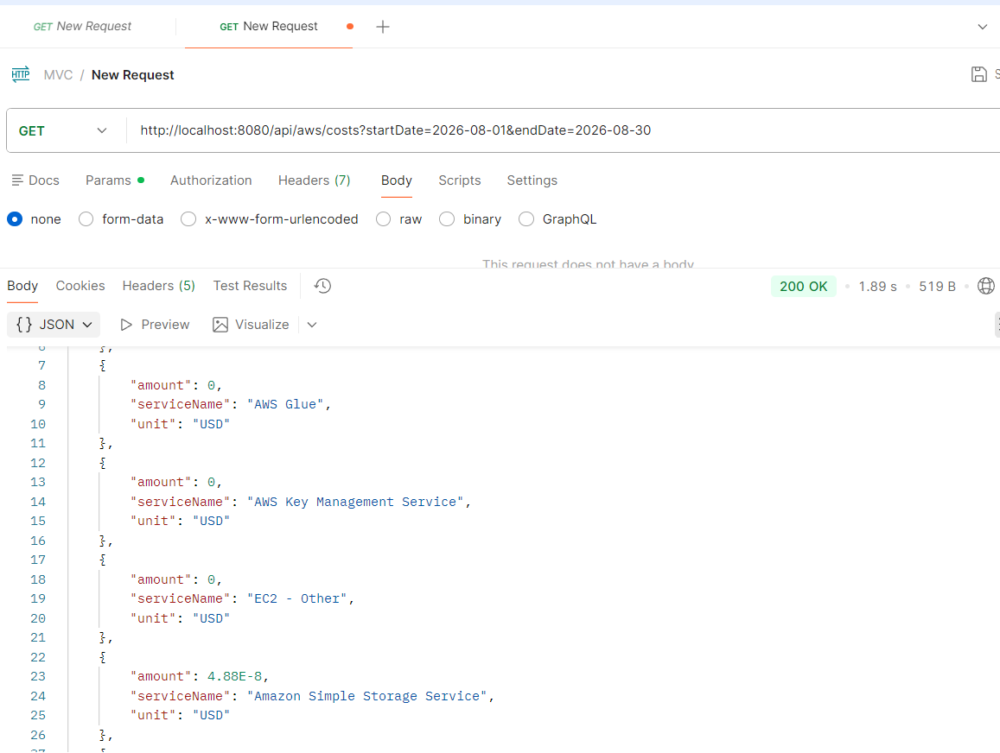

ReqeustParma으로 startDate와 endDate를 조회해보았음
참고로 startDate가 8월 1일이고
endDate가 8월 31일이면 실제 조회되는 구간은
8월 1일 ~ 8월 30일 까지이다.

### Controller 테스트 진행

방금 우린 AwsCostExplorerService -> AWS 요청 객체 생성 -> CostExplorerClient 호출 -> AWS 응답 변환
의 사이클을 Postman으로 확인했다.
이제는 Controller 테스트로 HTTP 요청 파라미터 -> LocalDate 변환 -> AwsCostExplorerService 호출 -> JSON 응답
을 테스트로 확인해보자

`$[0].serviceName` 를 쓰는데 여기서 `$[0]`을 쓰는 이유는 Controller 반환값이 객체 한개가아닌
`List<AwsServiceCost>`이기 때문이다.

- `$` 는 전체 배열, `$[0]`은 첫번째 비용 객체를 의미한다.

Controller 테스트를 진행하며 체크할 부분들은 다음과 같다.
- HTTP 날짜 파라미터를 정상적으로 받는가?
- 파라미터가 LocalDate로 변환되는가?
- Controller가 Service에 정확한 날짜를 전달하는가?
- Service가 돌려준 List<AwsServiceCost>를 JSON 배열로 반환하는가?
- JSON의 serviceName, amount, unit이 정확한가?

### AWS 서비스명을 CloudGuard의 CloudService로 변환하는 Mapper 구현

지금 현재 AWS 응답은
```java
new AwsServiceCost(
    "Amazon Simple Storage Service",
    new BigDecimal("0.0000000488"),
    "USD"
)
```
이렇게 옴

하지만 내가 만든 CloudGuard 내부에서는 Enum 형식이
`CloudService.S3` 임

그래서 외부 문자열과 내부 도메인을 연결해야하는 상황이다.
Enum속에 있는 EC2, RDS, S3 를 제외한 서비스들을 OTHER 이라고 칭할 예정

### AwsCostImportService

- 이 서비스는 Mapper이후 AWS 비용을 조회하고, 서비스명을 CloudGuard가 조회할수있게
- 변환한 뒤 기존 CostService를 통해 DB저장을 요청하는 Service

AwsCostImportServiceTest 구현으로 검증해볼것들
이 테스트는 다음 연결을 확인한다

1. AWS 비용 목록을 받았는가?
2. AWS 서비스명을 Mapper에 전달했는가?
3. 변환된 S3와 비용을 CostService에 전달했는가?

아직 실제 AWS나 DB는 사용하지 않음
세 객체를 모두 Mock으로 만들고 AwsCostImportService의 흐름만 검증.

# 2026-08-30

AWS 비용을 CloudGuard의 실제 저장 계층까지 연결되었는지 확인하기위해
AwsCostImportServiceIntegrationTest 테스트 구현


### 구현 내용

1. AWS 서비스명을 CloudService로 매핑하고, 미분류 서비스는 OTHER로 처리했다.
2. CostSource로 수동 등록(MANUAL)과 AWS 수집(AWS_COST_EXPLORER) 비용을 구분했다.
3. 서비스·날짜·출처로 기존 AWS 기록을 조회하여, 없으면 저장하고 있으면 최신 금액으로 갱신하도록 구현했다.
4. 자유로운 기간 조회를 지원하기 위해 수집 방식을 DAILY로 전환하고, AwsDailyServiceCost에 실제 비용 발생 날짜를 보존했다.
5. 날짜별·서비스별로 비용을 합산하여 저장하도록 변경했다.

### 검증 내용

1. Mock 기반 단위 테스트로 AWS 요청 조건, 응답 변환, 날짜별 합산과 저장 호출을 검증했다.
2. AWS 조회만 Mock으로 대체한 H2 통합 테스트로 실제 저장, 순차 재수집 시 중복 방지, 기존 ID를 유지한 금액 갱신, 수동 비용 보존을 검증했다.
3. flush()와 clear() 후 재조회하여 변경된 금액이 DB에 반영됐는지 확인했다.
4. 일별 수집 전환에 맞춰 기존 테스트를 수정하고 ./gradlew test 전체 통과를 확인했다.

### 핵심 학습

1. @Autowired는 등록된 Bean을 주입하고, @MockitoBean은 테스트에서 해당 Bean을 Mock으로 대체한다.
2. Mock 설정은 실제 호출 메서드·인자와 일치해야 하며, given(...).willReturn(...)까지 완성해야 한다.
3. 기간 전체 합계를 시작일에 저장하지 않고, 일별 비용을 해당 날짜에 저장해야 기간이 겹쳐도 올바르게 갱신할 수 있다.


# 2026-08-31

HTTP 요청 전달 및 오류 응답을 검증
POSTMAN으로 결과 확인

1. 정상 완료 시 204 확인
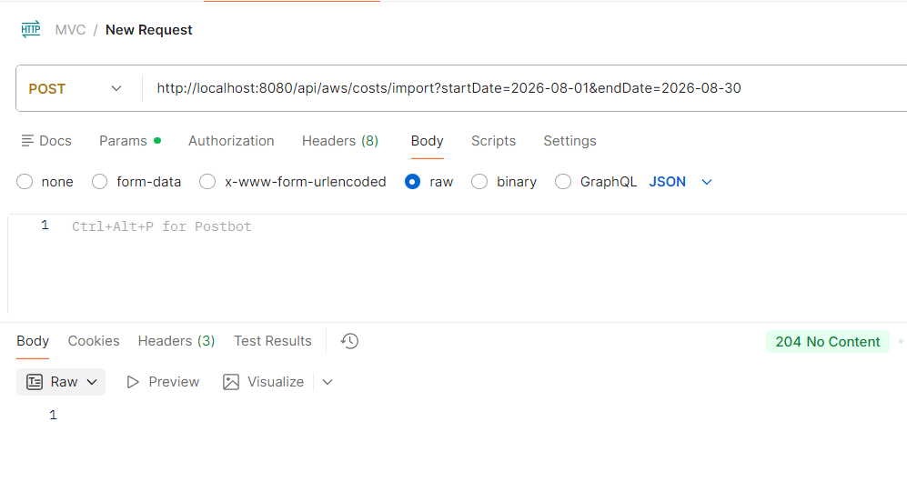


2. DB에 저장된 서비스별 비용과 총액 확인
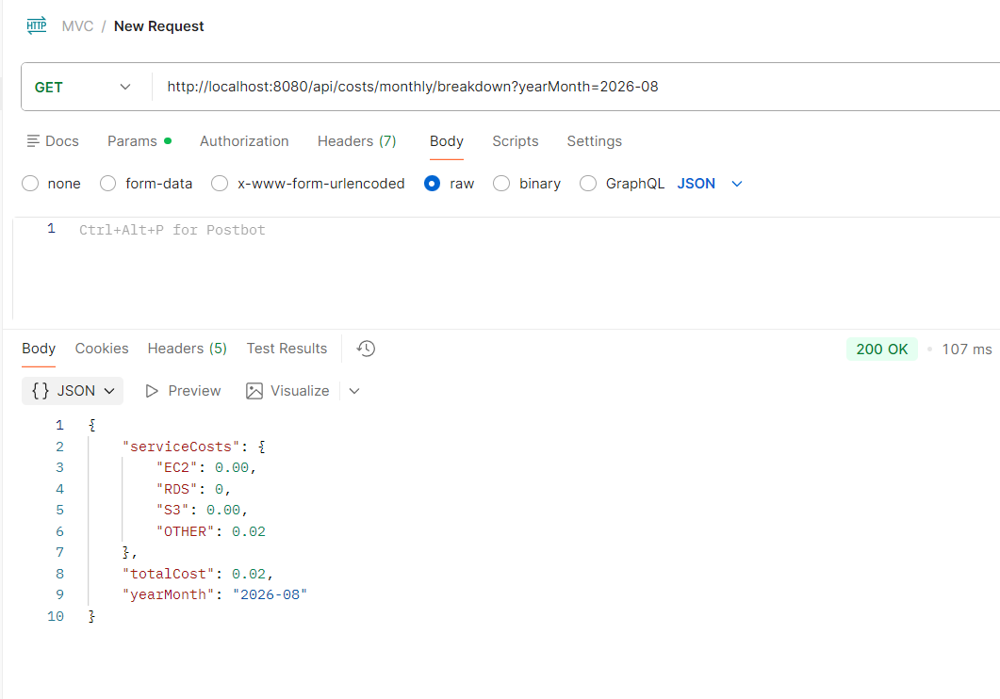

   
3. 1번을 다시 실행 후 2번을 실행해도, 값이 2배로 늘어나지않는것 체크
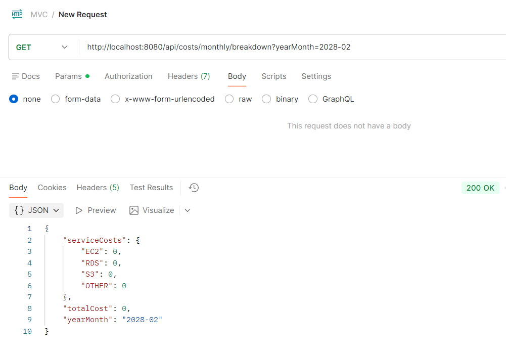

4. 시작일이 종료일보다 빠를 때 400을 뱉는지 체크
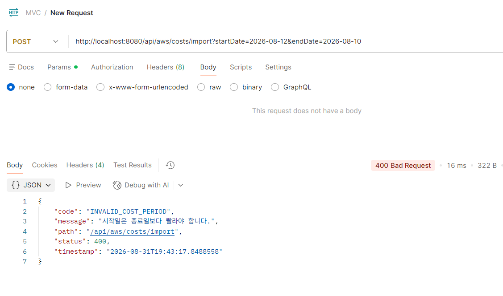

AWS 수집 통화인 USD가 아니면 보장하지않도록 검증하는 validateCurrency 추가하고 테스트 수행


비용은 그대로 두고, 예산만 바꾸었을때 SAFE가 EXCEEDED가 되는지 확인
월예산은 0.02 -> 100 으로 변경했음
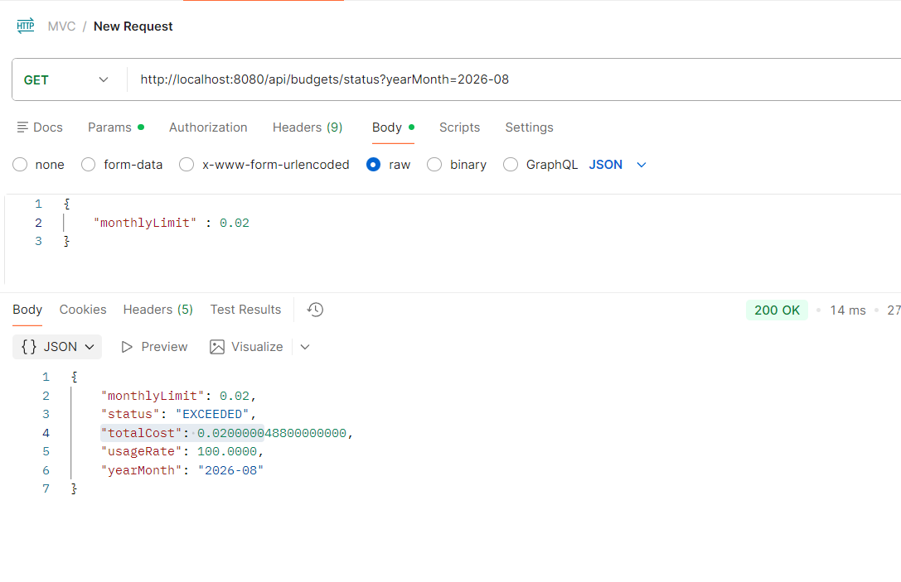

## MYSQL 실제 연결

예산 등록 전 실제 AWS에서의 사용비용 체크
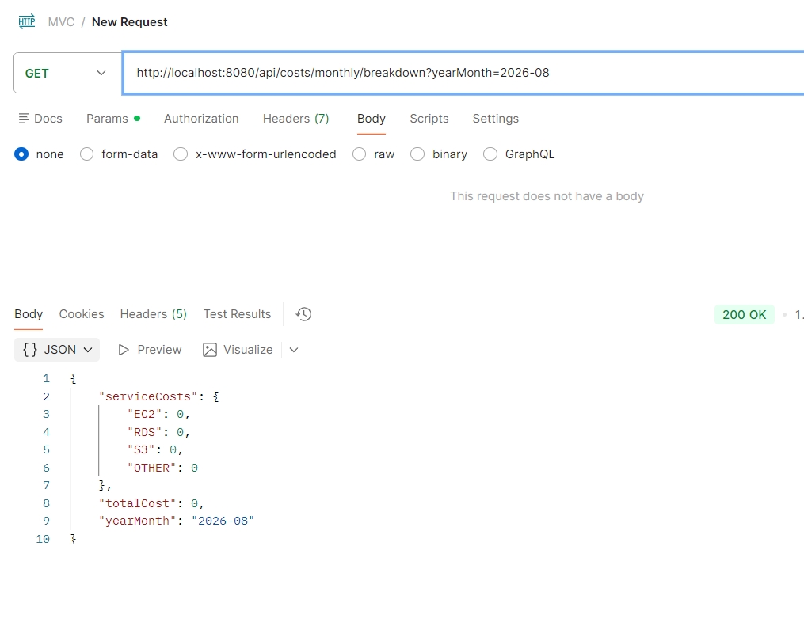

예산 등록
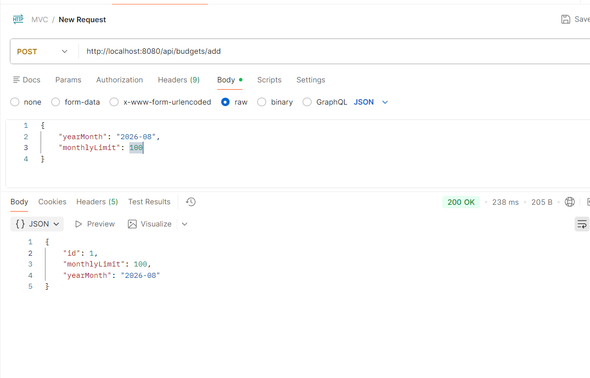

예산 상태 조회
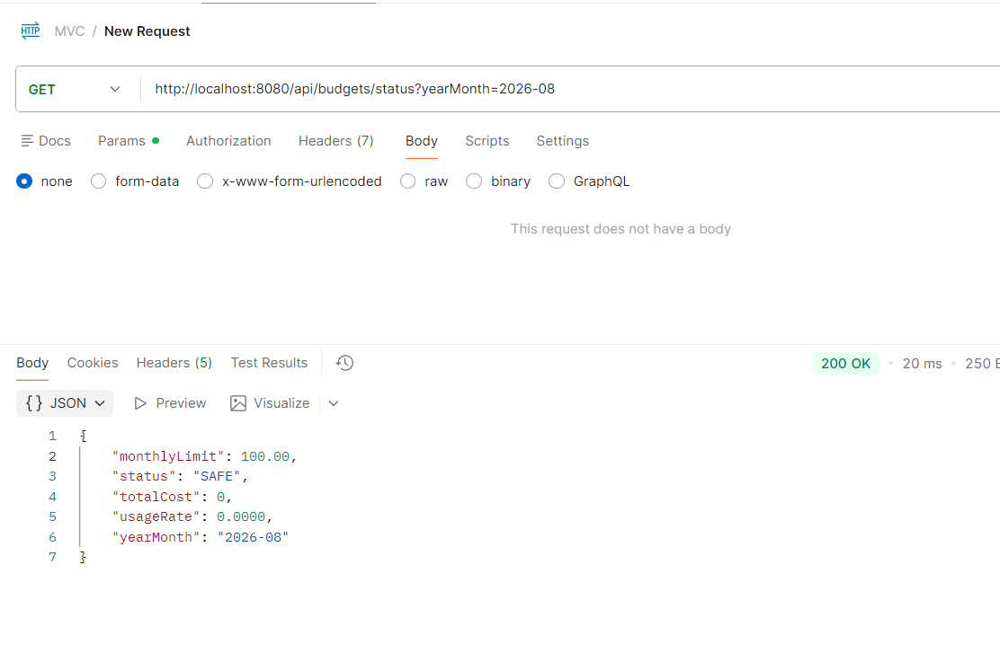

서버 종료 후 다시 내가 설정한 local profile로 시작되는지 체크
`2026-08-31T21:10:59.387+09:00  INFO 12212 --- 
[cloudguard] [           main] c.c.cloudguard.CloudguardApplication:
The following 1 profile is active: "local"`

성공

재시작 후 다시 조회는 실패 - 월예산이 저장되어있지않음
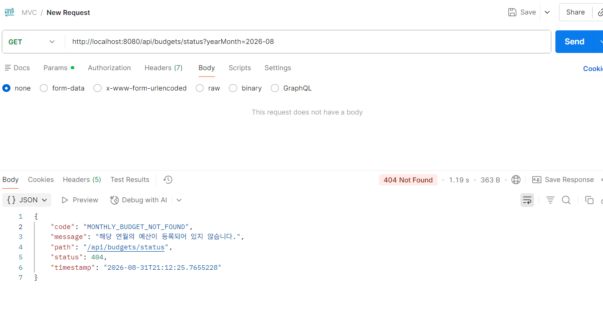


알고보니 우리가 배포용 appliation-local.properties를 따로 설정안하고
monthly_budgets로 기존 Mysql 예약어엿던 yearMonth를 수정안했어서 
에러가 났었다
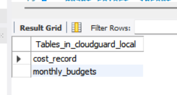

수정후 서버실행 성공 후에 workbench 속 테이블들

## 재시도
1. 예산 설정
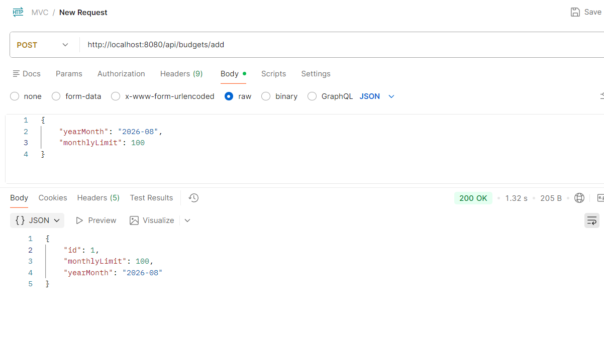

2. DB확인
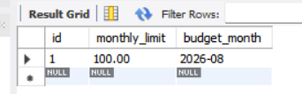

3. 서버 재시작 후 남아있는지 확인
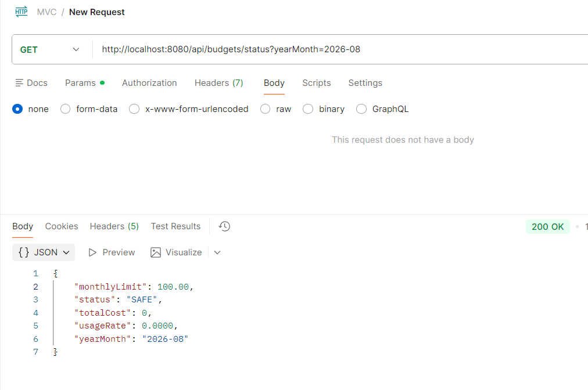
4. breakdown과 monthly status의 비용이 같은지 체크
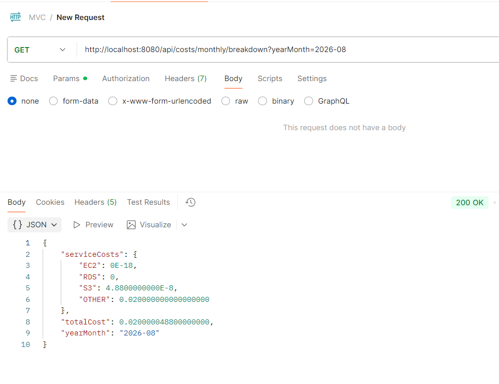

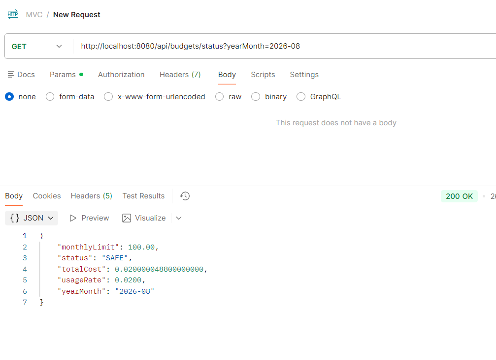