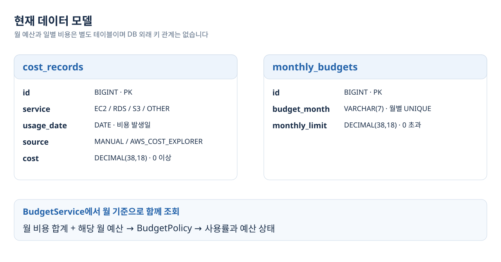

# CloudGuard

**AWS 비용을 일별로 수집하고 월별, 서비스별 집계와 예산 상태를 제공하는 Java/Spring 백엔드입니다.**

클라우드 실습 비용을 월 예산과 함께 확인하려고 만들었습니다. 같은 기간을 다시 수집하면 기존 AWS 기록을 갱신하고, 수동으로 등록한 비용은 보존합니다.

[포트폴리오](docs/PORTFOLIO.md), [설계와 검증](docs/ARCHITECTURE.md), [실행 및 API](docs/RUNBOOK.md), [확장 계획](docs/ROADMAP.md), [개발 기록](docs/DEVELOPMENT_LOG.md)

## 서비스 흐름


| 기능 | 현재 구현 |
| --- | --- |
| AWS 비용 수집 | DAILY 조회, 모든 응답 페이지 처리, 서비스명 매핑, USD 검증 |
| 비용 저장과 조회 | 수동 등록, AWS 기록 생성, 갱신, 월별 총액과 EC2, RDS, S3, OTHER별 집계 |
| 월 예산 관리 | 예산 등록, 변경, 사용률과 SAFE / CAUTION / WARNING / EXCEEDED 상태 조회 |
| 요청 검증 | Bean Validation, 잘못된 요청, 예산 중복, 미등록에 대한 공통 오류 응답 |

## 재수집 처리


서비스, 발생 날짜, 출처로 기존 AWS 기록을 찾아 금액을 변경합니다. H2 통합 테스트에서 **AWS 10.5 → 12 갱신 시 기존 ID와 기록 1건 유지**, 수동 100 보존, 겹치는 날짜만 갱신되는 것을 확인했습니다. [코드와 테스트](docs/PORTFOLIO.md#1-재수집-시-비용-중복을-방지하는-저장-구조)

소수 비용은 `BigDecimal`과 `DECIMAL(38,18)`을 사용합니다. `0.0000000488`을 저장한 뒤 `flush()`, `clear()`와 재조회로 동일 값을 확인했습니다. 모든 수치는 테스트 입력과 기댓값입니다.

## 데이터 모델



월 예산과 비용은 별도 테이블로 관리합니다. `BudgetService`가 해당 월 예산과 비용 합계를 조회해 상태를 계산합니다. [스키마와 제약](docs/ARCHITECTURE.md#데이터-모델)

## 기술과 검증

| 영역 | 기술 |
| --- | --- |
| 백엔드 | Java 17, Spring Boot 4.1.0, Spring MVC, Spring Data JPA |
| 데이터 | MySQL 8.0, Flyway, H2 테스트 DB |
| 연동과 테스트 | AWS SDK v2, JUnit 5, AssertJ, Mockito, MockMvc |
| 실행 및 배포 구성 | Gradle, Docker Compose, GitHub Actions, ECR, EC2, SSM |

기준 [Actions 실행](https://github.com/kjune922/CloudGuard/actions/runs/33743715476)의 테스트 단계는 통과했습니다. AWS 자격 증명 설정은 실패하여 ECR, SSM 단계는 실행되지 않았습니다. [검증 환경과 배포 도표](docs/ARCHITECTURE.md#검증-환경과-배포-구성)

현재 재수집 검증은 순차 실행 범위입니다. 예산 반올림 경계값, 동시 수집 중복, 실제 MySQL 마이그레이션 검증을 먼저 개선합니다. 상세 재현 조건은 [체크리스트](docs/READINESS.md)에 정리했습니다.

## 실행

Java 17 JDK와 Docker Compose가 필요합니다. 저장소 루트의 `.env`에 아래 값을 설정합니다.

```dotenv
CLOUDGUARD_DOCKER_DB_USERNAME=cloudguard
CLOUDGUARD_DOCKER_DB_PASSWORD=choose_a_local_password
CLOUDGUARD_DOCKER_DB_ROOT_PASSWORD=choose_a_different_local_password
```

```bash
docker compose up --build -d
curl 'http://localhost:8080/api/costs/monthly/breakdown?yearMonth=2026-08'
bash gradlew test
```

수동 비용 등록, 조회는 위 환경에서 실행할 수 있습니다. AWS 수집에는 별도 자격 증명이 필요하며 현재 Compose에는 전달 설정이 없습니다. [전체 실행 절차](docs/RUNBOOK.md)
