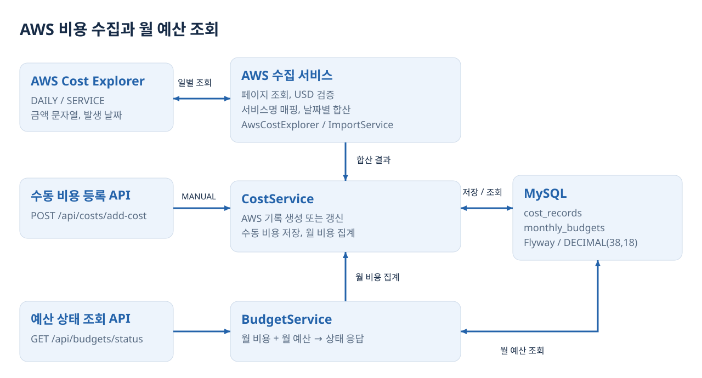
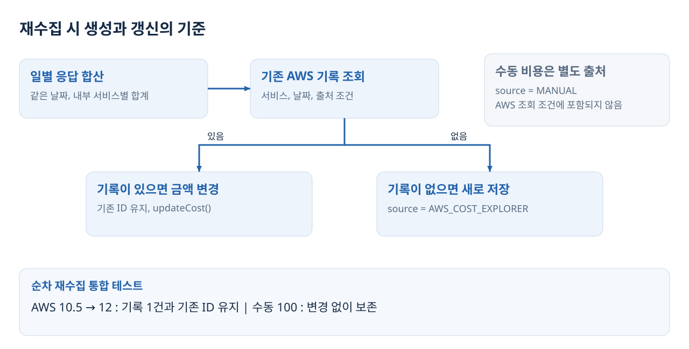
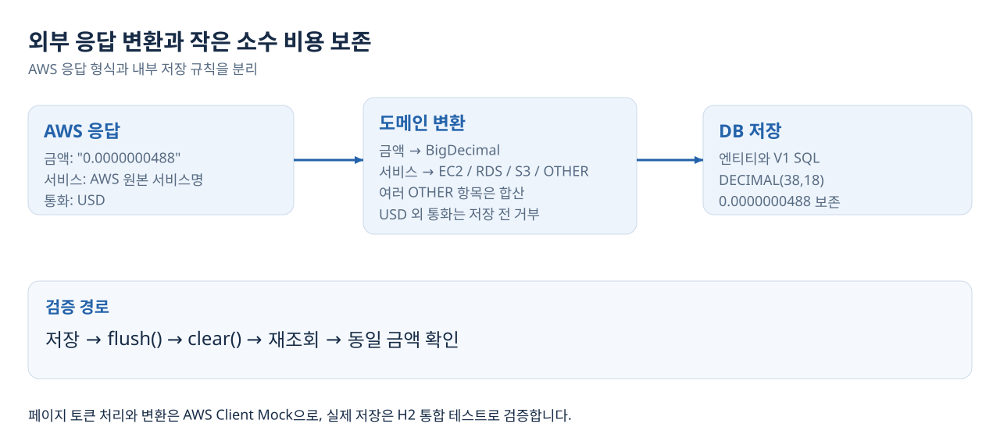
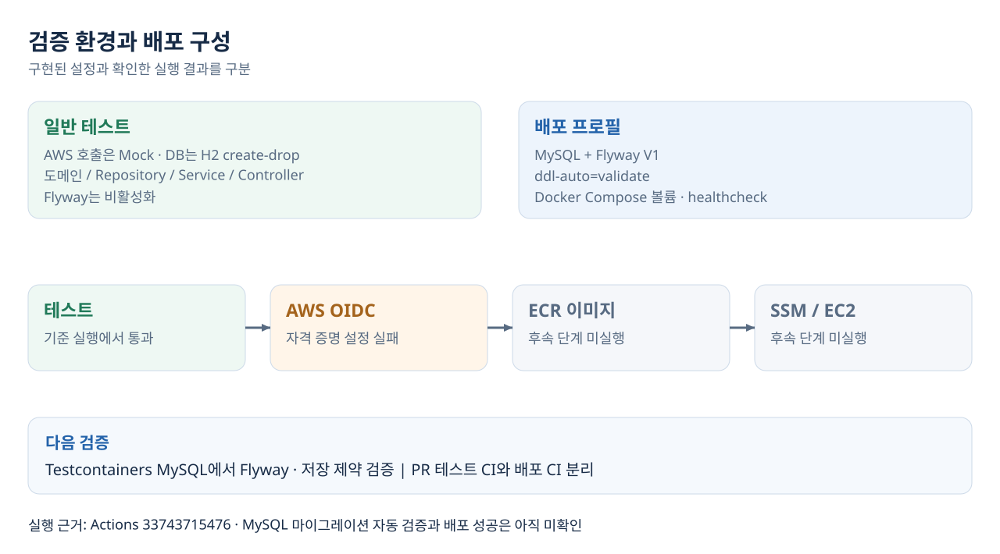

# CloudGuard 백엔드 포트폴리오

AWS 비용을 일별로 수집하고 월별 집계와 예산 상태를 제공하는 개인 프로젝트입니다. 재수집 시 집계가 중복되지 않고 수정된 금액이 저장되도록 설계했습니다.

- 작성자: 이경준, GitHub [kjune922](https://github.com/kjune922)
- 역할: Java/Spring API, 비용, 예산 도메인, JPA 저장 계층, 테스트 및 실행 환경 구현
- 기술: Java 17, Spring Boot, Spring Data JPA, MySQL, Flyway, AWS SDK v2

## 프로젝트가 해결하는 문제

클라우드 실습 비용을 월 예산과 함께 확인하도록 수집, 집계, 상태 판단을 연결했습니다. 주요 과제는 겹치는 기간의 비용 중복, 외부 응답의 도메인 변환, 환경별 DB 구조 관리였습니다.

## 1 재수집 시 비용 중복을 방지하는 저장 구조

### Situation

기간 전체 비용을 시작일에 저장하거나 매번 새 기록을 추가하면 겹치는 기간을 조회할 때 월 합계가 왜곡될 수 있었습니다. 동일 날짜의 수동 등록 비용도 보존해야 했습니다.

### Task

AWS 비용의 발생 날짜를 유지하고 순차 재수집에서는 기존 기록의 금액을 갱신해야 했습니다. 월 집계와 예산 상태도 변경된 비용을 사용해야 했습니다.

### Action

Cost Explorer를 DAILY로 조회하고 `AwsDailyServiceCost`에 발생 날짜를 담았습니다. 원본 서비스명을 내부 `CloudService`로 변환한 뒤 날짜, 서비스별로 합산했습니다. `CostSource`로 수동 비용과 AWS 비용을 구분하고 서비스, 날짜, 출처로 기존 AWS 기록을 찾아 없으면 생성하고 있으면 금액을 변경했습니다.

`AwsCostImportService`는 수집 흐름을 조정하고 `CostService`와 엔티티는 저장, 갱신을 담당합니다. H2 통합 테스트에서는 AWS 조회만 Mock으로 교체하고 실제 Repository를 사용했습니다.

### Result

| 검증 시나리오 | 테스트에서 확인한 결과 |
| --- | --- |
| 같은 기간 두 번 수집 | 기록 1건과 금액 10.5 유지 |
| 금액 10.5 → 12 변경 | 기존 ID 유지, 금액 갱신 |
| 8/10~8/11과 8/11~8/12 순차 수집 | 8/10 금액 3 유지, 8/11은 5 → 7, 8/12 금액 2 추가 |
| 수동 100과 AWS 10.5 함께 존재 | 수동 100 유지, AWS만 12로 갱신 |
| 예산 100에서 비용 80 → 110 | 80% CAUTION → 110% EXCEEDED |

금액 갱신은 `flush()`와 `clear()` 후 재조회하여 영속성 컨텍스트의 객체만 확인하는 것을 피했습니다. 이 결과는 순차 실행 검증이며 동시 요청의 중복 방지는 후속 과제입니다. 모든 수치는 테스트 입력, 기대값입니다.

근거: [수집 서비스](../src/main/java/com/cloudguard/cloudguard/cost/aws/service/AwsCostImportService.java), [저장 서비스](../src/main/java/com/cloudguard/cloudguard/cost/service/CostService.java), [통합 테스트](../src/test/java/com/cloudguard/cloudguard/cost/aws/service/AwsCostImportServiceIntegrationTest.java)

## 2 외부 비용 데이터의 변환과 소수 정밀도 보존

### Situation

AWS는 비용을 문자열로 반환하고 내부 enum과 다른 서비스명을 사용합니다. 여러 미분류 서비스가 OTHER에 대응할 수 있고, 비용에는 매우 작은 소수가 포함됩니다.

### Task

외부 응답과 내부 도메인을 분리하고 모든 응답 페이지를 읽어 합산해야 했습니다. 작은 금액도 저장과 재조회에서 유지해야 했습니다.

### Action

원본 응답 DTO와 `AwsServiceNameMapper`를 분리했습니다. 미분류 서비스는 OTHER로 합산하고 USD가 아닌 응답은 저장 전에 거부했습니다. `nextPageToken`으로 다음 페이지를 조회하면서 기간, 집계 조건을 유지했습니다.

문자열 금액은 `BigDecimal`로 변환하고 엔티티와 Flyway 스키마에 `DECIMAL(38,18)`을 사용했습니다. AWS Client를 Mock으로 대체하여 요청 조건, 페이지 이동, 응답 변환을 검증했습니다.

### Result

다음 페이지 토큰과 조회 조건 유지, 전체 페이지 결과 반환, 날짜별 합산과 OTHER 매핑을 단위 테스트로 확인했습니다. 통합 테스트에서는 `0.0000000488` 저장 후 flush/clear와 재조회로 동일 값이 유지되는 것을 확인했습니다.

현재 OTHER는 미분류 합계이며 원본 서비스별 상세 조회를 지원하지 않습니다. 음수 비용을 거부하므로 환불, 크레딧을 포함한 청구 데이터 전체를 지원한다고 주장하지 않습니다.

근거: [AWS 조회 서비스](../src/main/java/com/cloudguard/cloudguard/cost/aws/service/AwsCostExplorerService.java), [Mapper](../src/main/java/com/cloudguard/cloudguard/cost/aws/mapper/AwsServiceNameMapper.java), [페이지 테스트](../src/test/java/com/cloudguard/cloudguard/cost/aws/service/AwsCostExplorerServiceTest.java), [마이그레이션](../src/main/resources/db/migration/V1__init_schema.sql)

## 3 스키마 이력과 검증 환경의 분리

### Situation

자동 스키마 변경만 사용하면 SQL 변경이 코드 리뷰와 버전 관리에서 드러나지 않습니다. 테스트가 실제 AWS를 호출하면 자격 증명과 외부 환경에 영향을 받습니다.

### Task

DB 구조를 명시적인 SQL로 관리하고 비용, 예산 규칙과 HTTP 동작을 실제 AWS 호출 없이 반복 검증하도록 구성했습니다.

### Action

Flyway V1에 테이블, 월 예산 고유 제약, 금액 CHECK 제약과 조회 인덱스를 정의했습니다. `prod`는 Flyway와 `ddl-auto=validate`를 사용합니다. 테스트는 H2 `create-drop`과 AWS Mock을 사용하고 도메인, Repository, Service, Controller 역할에 맞춰 작성했습니다.

Docker Compose에는 MySQL 볼륨과 healthcheck를 구성했습니다. Actions에는 테스트 이후 OIDC 자격 증명 설정, ECR 이미지 업로드, SSM 배포 순서를 작성했습니다.

### Result

기준 커밋의 [Actions 실행](https://github.com/kjune922/CloudGuard/actions/runs/33743715476)에서 테스트 단계 통과를 확인했습니다. AWS 자격 증명 설정은 실패하여 자동 배포 성공 사례로 사용하지 않습니다. H2 테스트는 Flyway를 실행하지 않으므로 MySQL V1 검증과 구분합니다.

근거: [배포 프로필](../src/main/resources/application-prod.properties), [테스트 프로필](../src/test/resources/application-test.properties), [워크플로](../.github/workflows/deploy.yml)

## 회고와 다음 개선

API 호출 성공뿐 아니라 저장 단위와 갱신 기준을 먼저 정해야 함을 배웠습니다. 외부 응답의 날짜, 서비스, 통화를 명시적으로 변환하고 실제 저장 계층까지 검증하면서 어떤 조건에서 데이터가 유지되는지 확인했습니다.

메인 포트폴리오 완성 단계에서는 예산 반올림 경계값, 동시 수집 중복, 실제 MySQL 마이그레이션 검증을 우선 개선합니다. 재현 조건과 완료 기준은 [체크리스트](READINESS.md)에 정리했습니다.

[데이터 모델과 설계 상세](ARCHITECTURE.md), [서비스 확장 계획](ROADMAP.md)
